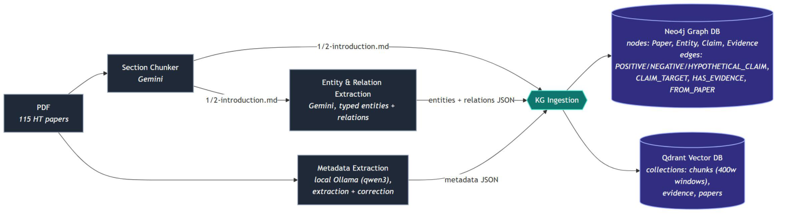
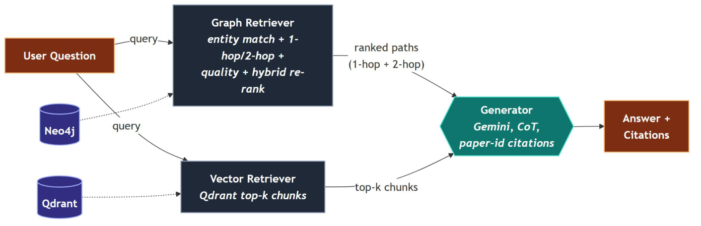
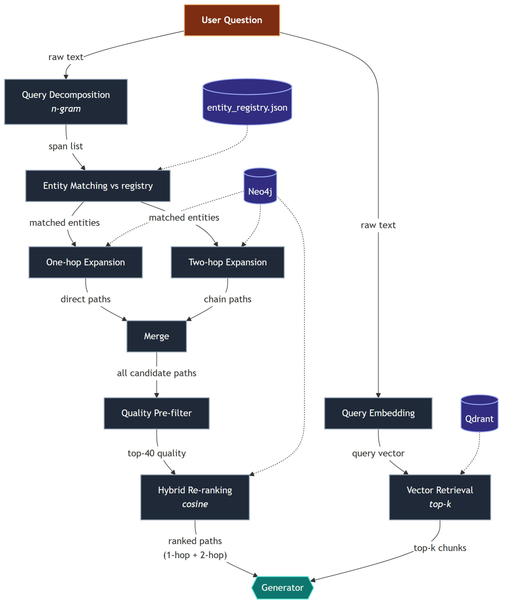

# Graph RAG - Hashimoto's Thyroiditis

**Live demo: [ht-rag-web.vercel.app](https://ht-rag-web.vercel.app/)**
&nbsp;·&nbsp;
**Thesis: [*Knowledge Graph-Based GraphRAG for Clinical Question Answering in Hashimoto's Thyroiditis Built from Peer-Reviewed Literature*](https://bth.diva-portal.org/smash/record.jsf?pid=diva2%3A2084651)** (DIVA portal)

A Graph RAG system built over 115 peer reviewed research papers on Hashimoto's thyroiditis. A
question is answered by retrieving structured claims from a knowledge graph
(Neo4j) alongside semantically similar text chunks (Qdrant), then generating a
cited answer.

This repository is the research and experimentation pipeline behind the thesis.
The full thesis, including all results, evaluation, and methodology, is
published on the [DIVA portal](https://bth.diva-portal.org/smash/record.jsf?pid=diva2%3A2084651).
It takes the corpus from raw PDFs through to a cited question-answering flow. A
separate web app ([ht-rag-web.vercel.app](https://ht-rag-web.vercel.app/))
demos the query-time system in the browser.

The full pipeline runs from raw PDFs to a live question-answering flow. Every
stage is also usable on its own; the root [`main.py`](main.py) wires the
query-time system together and orchestrates the database build.

---

## System overview

The system has two main stages: knowledge graph construction, and retrieval and generation.

### Knowledge graph construction

Figure 1 shows the knowledge graph construction stage of this pipeline, which
converts unstructured PDFs into a graph database for relational retrieval and a
vector database for semantic retrieval.



*Figure 1: Knowledge graph construction.*

Each paper is chunked into sections, mined for typed entities and relations, and
enriched with metadata. KG ingestion writes the graph (Paper / Entity / Claim /
Evidence nodes) to Neo4j and the text/evidence/paper embeddings to Qdrant.

### Retrieval and generation

Figure 2 shows the retrieval and generation stage, which operates over the
knowledge graph and vector database constructed in the previous stage.



*Figure 2: Retrieval and generation.*

- Graph retrieval pulls direct claims (1-hop) and reasoning chains (2-hop) about
  the matched entities, then ranks them by evidence quality and embedding
  similarity to the query.
- Vector retrieval pulls the most semantically similar source chunks.
- The generator receives both and produces a `<reasoning>` + `<answer>` response
  with inline citations back to the graph paths and chunks.

#### Retrieval detail: hybrid graph retrieval

Figure 3 details the hybrid graph retrieval used in the previous stage. The
graph side is a multi-stage hybrid pipeline. The question is decomposed into
spans, matched against the entity registry, and expanded into 1-hop and 2-hop
paths. Candidates are merged, cut down by a quality pre-filter, then re-ranked by
cosine similarity between the query and each path (the hybrid step). In parallel
the raw question is embedded and used for top-k vector retrieval. Both feed the
generator.



*Figure 3: Hybrid graph retrieval detail.*

---

## Pipeline stages

| # | Stage | Module |
|---|---|---|
| 1 | Metadata extraction | [`extract_metadata/`](extract_metadata/README.md) |
| 2 | PDF section chunking | [`pdf_section_chunker/`](pdf_section_chunker/README.md) |
| 3 | Entity & relation extraction | [`extract_entity_relation/`](extract_entity_relation/README.md) |
| 4 | Knowledge graph build (registries, Neo4j, Qdrant) | [`kg_ingestion/`](kg_ingestion/) |
| 5 | Retrieval | [`retriever/`](retriever/README.md) |
| 6 | Generation | [`generator/`](generator/README.md) |

---

## Prerequisites

- Python 3.12+ and [uv](https://docs.astral.sh/uv/)
- Docker (for the local Neo4j and Qdrant databases)
- A Gemini API key (embeddings and generation; also the extraction stages)
- No GPU required. Embeddings and generation are offloaded to the Gemini API.

See [`.env.example`](.env.example) for the full list of environment variables.

---

## Setup

### 1. Install dependencies

```bash
uv sync
```

### 2. Environment variables

Copy the example and fill it in:

```bash
cp .env.example .env
```

The canonical (local) pipeline needs:

```
GEMINI_API_KEY=your-key
NEO4J_USER=neo4j
NEO4J_PASSWORD=your-neo4j-password
NEO4J_DATABASE=neo4j
```

### 3. Provide the corpus

The pipeline reads its inputs from `data/` (PDFs, metadata, section maps).
[`data.example/`](data.example/README.md) shows the exact layout and file
formats. Copy it and drop in the real corpus:

```bash
cp -r data.example data
# add your PDFs to data/pdfs/ as 1.pdf, 2.pdf, ...
```

## Running

Run everything from the repo root (the entity registry path is resolved relative
to the working directory).

### Build the graph

Ingestion only (assumes the committed extraction outputs from stages 1-3):

```bash
uv run main.py build
```

This runs, in order: entity + claim registries -> Neo4j (schema, papers,
entities, claims, evidence) -> Qdrant (collections, papers, chunks, evidence).
Each stage is idempotent, so re-running is safe.

To also re-run the upstream Gemini extraction stages from scratch (long, needs
`GEMINI_API_KEY`):

```bash
uv run main.py build --with-extraction
```

### Ask a question

```bash
uv run main.py query "What is the effect of selenium on thyroid antibodies in HT?"
```

This prints the retrieved graph paths, the vector chunks, and the generated
cited answer.

Individual stages remain runnable on their own, for example:

```bash
uv run -m kg_ingestion.neo4j.schema
uv run -m extract_entity_relation.main --model gemini
```
